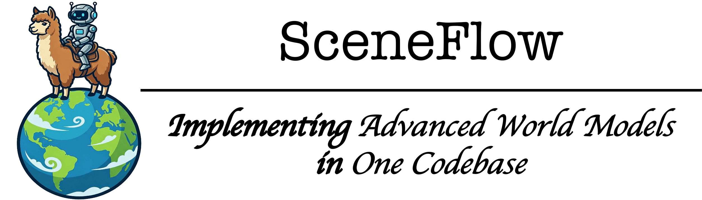

<div align="center" markdown="1">



#### A Unified Codebase for Advanced World Models <!-- omit in toc -->
---

<a href="https://github.com/OpenDCAI/SceneFlow"></a>

</div>


### Table of Contents <!-- omit in toc -->
- [Features](#features)
  - [仓库目标](#仓库目标)
  - [支持任务](#支持任务)
- [Getting Started](#getting-started)
  - [Installation](#installation)
  - [Quickstart](#quickstart)
- [Structure](#structure)
- [Planning](#planning)
- [For Developers](#for-developers)
- [Acknowledgment](#acknowledgment)
- [Citation](#citation)


### Features
#### 仓库目标
SceneFlow 的主要目标包括以下内容：
- 建立一套统一且规范的 **world model framework**，使现有世界模型相关代码的调用更加规范与一致；
- 集成开源的世界模型相关研究成果，并系统整理收录相关论文，供研究者参考与使用。

#### 支持任务
SceneFlow 涵盖以下与 **World Model** 相关的研究方向：

| 任务类别 | 子任务 | 代表性方法/模型 |
| :--- | :--- | :--- |
| **Video Generation** | Navigation Generation | lingbot, matrix-game, hunyuan-worldplay, genie3 等 |
| | Long Video Generation | sora-2, veo-3, wan 等 |
| **3D Scene Generation** | 3D 场景生成 | flash-world, vggt 等 |
| **Reasoning** | VQA（视觉问答） | spatialVLM, omnivinci 等具备世界理解的 VLM 模型 |
| | VLA（视觉语言行动） | pi-0, pi-0.5, giga-brain 等方法 |


### Getting Started
#### Installation
首先创建conda环境
```bash
conda create -n "sceneflow" python=3.10 -y
conda activate "sceneflow"
```
接着可以利用已有的安装脚本进行安装
```bash
cd SceneFlow
bash scripts/setup/default_install.sh
```
一些方法有特殊的安装需求，所有安装脚本在 `./scripts/setup`
> 📖 完整安装指南请参阅 [docs/installation.md](docs/installation.md)


#### Quickstart
在安装过基础环境后，可以通过下面的两个指令分别测试 matrix-game-2 生成以及多轮交互效果：
```bash
cd SceneFlow
bash scripts/test_inference/test_nav_video_gen.sh matrix-game-2
bash scripts/test_stream/test_nav_video_gen.sh matrix-game-2
```
其他方法的运行脚本可在 `scripts/test_inference` 以及 `scripts/test_stream` 路径下进行查看


### Structure
为了让开发者以及用户们更好地了解我们的 SceneFlow，我们在这里对我们代码中的细节进行介绍，首先我们的框架结构如下：
```txt
SceneFlow
├─ assets
├─ data                                # 测试数据
│  ├─ benchmarks
│  │  └─ reasoning
│  ├─ test_case
│  └─ ...
├─ docs                                # 相关文档
├─ examples                            # 运行benchmark测例
├─ scripts                             # 所有关键测试脚本
├─ src
│  └─ sceneflow                        # 主路径
│     ├─ base_models                   # 基础模型
│     │  ├─ diffusion_model
│     │  │  ├─ image
│     │  │  ├─ video
│     │  │  └─ ...
│     │  ├─ llm_mllm_core
│     │  │  ├─ llm
│     │  │  ├─ mllm
│     │  │  └─ ...
│     │  ├─ perception_core
│     │  │  ├─ detection
│     │  │  ├─ general_perception
│     │  │  └─ ...
│     │  └─ three_dimensions
│     │     ├─ depth
│     │     ├─ general_3d
│     │     └─ ...
│     ├─ memories                      # 记忆模块
│     │  ├─ reasoning
│     │  └─ visual_synthesis
│     ├─ operators                     # 输入、交互信号处理
│     ├─ pipelines                     # 所有运行管线
│     ├─ reasoning                     # 推理模块
│     │  ├─ audio_reasoning
│     │  ├─ general_reasoning
│     │  └─ spatial_reasoning
│     ├─ representations               # 表征模块
│     │  ├─ point_clouds_generation
│     │  └─ simulation_environment
│     └─ synthesis                     # 生成模块
│        ├─ audio_generation
│        ├─ visual_generation
│        └─ vla_generation
├─ submodules                          # diff-gaussian-raster 等附属安装
├─ test                                # 所有测试代码
├─ test_stream                         # 所有交互测试代码
└─ tools                               # 相关工具
   ├─ installing
   └─ vibe_code
```
在使用 SceneFlow 时通常直接调用 **pipeline** 类，而 pipeline 类中，需要完成权重加载，环境初始化等任务，同时用户与 **operator** 类进行交互，并且利用 **synthesis**、**reasoning**、**representation** 等类完成生成。在多轮交互中，使用 **memory** 类对运行流程进行记忆。


### Planning
- 我们在 [docs/awesome_world_models.md](docs/awesome_world_model.md) 中记录了最前沿的 world models 相关的研究，同时我们欢迎大家在这里提供一些有价值的研究。
- 我们在 [docs/planning.md](docs/planning.md) 中记录了我们后续的**训练**以及**优化**计划。


### For Developers
我们欢迎各位开发者共同参与，帮助完善 **SceneFlow** 这一统一世界模型仓库。推荐采用 **Vibe Coding** 方式进行快捷的代码提交，相关提示词可参考 `tools/vibe_code/prompts` 目录下的内容。同时也可以向 [docs/planning.md](docs/planning.md) 以及 [docs/awesome_world_models.md](docs/awesome_world_model.md) 补充高质量的world model相关工作。期待你的贡献！


### Acknowledgment
本项目为 [DataFlow](https://github.com/OpenDCAI/DataFlow) 、[DataFlow-MM](https://github.com/OpenDCAI/DataFlow-MM) 在世界模型任务上的拓展。同时我们与 [RayOrch](https://github.com/OpenDCAI/RayOrch) 、[Paper2Any](https://github.com/OpenDCAI/Paper2Any) 等工作积极联动中。


### Citation
如果我们的 **SceneFlow** 为你带来了帮助，欢迎给我们的repo一个star🌟，并考虑引用相关论文：
```bibtex


@article{zeng2026research,
  title={Research on World Models Is Not Merely Injecting World Knowledge into Specific Tasks},
  author={Zeng, Bohan and Zhu, Kaixin and Hua, Daili and Li, Bozhou and Tong, Chengzhuo and Wang, Yuran and Huang, Xinyi and Dai, Yifan and Zhang, Zixiang and Yang, Yifan and others},
  journal={arXiv preprint arXiv:2602.01630},
  year={2026}
}
```
